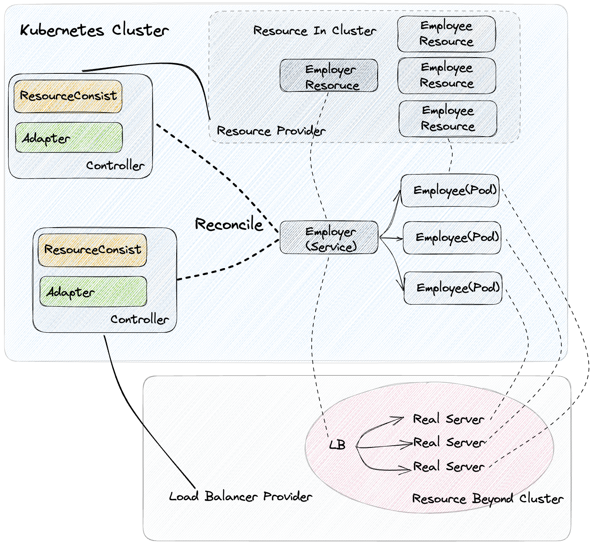

# ResourceConsist
**ResourceConsist** ([official site](https://kusionstack.io/docs/operating/manuals/resourceconsist)) aims to make a customized controller can be realized easily, and offering the ability of controllers following [**PodOpsLifecycle**](https://kusionstack.io/docs/operating/concepts/podopslifecycle).

The only thing users need to do to realize a customized controller is writing an adapter implementing [ReconcileAdapter](https://github.com/KusionStack/resourceconsist/blob/main/pkg/frame/controller/types.go#L61). For controllers following **PodOpsLifecycle**, [WebhookAdapter](https://github.com/KusionStack/resourceconsist/blob/main/pkg/frame/webhook/types.go#L26) is also necessary to be implemented.

👉 Please refer to [key concepts](https://github.com/KusionStack/resourceconsist/tree/main/docs/keyconcepts.md) to find out what 🤠**Employer**/👩‍💻**Employee**/... are.

## 💻 Get Started
### 🔧 Tutorial
Please visit [tutorial](https://github.com/KusionStack/resourceconsist/tree/main/docs/tutorial.md) to start a controller.
## ☎️ Contact us
- Twitter: [KusionStack](https://twitter.com/KusionStack)
- Slack: [Kusionstack](https://join.slack.com/t/kusionstack/shared_invite/zt-19lqcc3a9-_kTNwagaT5qwBE~my5Lnxg)
- DingTalk (Chinese): 42753001
- Wechat Group (Chinese)

  
## 🎖︎ Contribution guide
**ResourceConsist** is currently in its early stages. Our goal is to make a customized controller can be realized easily, especially for controllers following PodOpsLifecycle. 

We will continue implementing more common used traffic controller into [adapters](https://github.com/KusionStack/resourceconsist/tree/main/pkg/adapters)

🚀 If you want to contribute to built-in adapters, you can start from contribute them into [experimental/adapters](https://github.com/KusionStack/resourceconsist/tree/main/pkg/experimental/adapters). We will move it into [adapters](https://github.com/KusionStack/resourceconsist/tree/main/pkg/adapters) when the experimental adapters are ready to release.

We welcome everyone to participate in construction with us. Visit the [contribution guide](docs/contribution.md)
to understand how to participate in the contribution KusionStack project.
If you have any questions, please [submit the issue](https://github.com/KusionStack/resourceconsist/issues).
